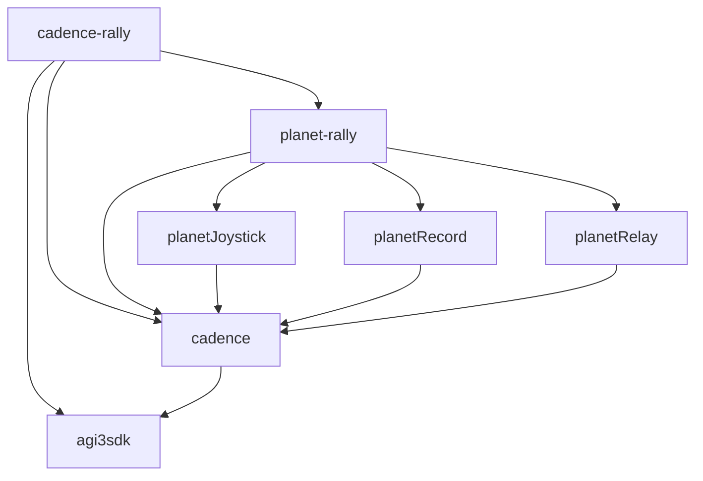

# Architecture and repository boundaries

Cadence owns robot execution. PlanetJoystick supplies operator input to Cadence's
public interface. Task applications extend Cadence with states, transitions and
deployment configuration; they inherit the same operator interface.

## Repository responsibilities

| Repository | Owns | Reuses |
| --- | --- | --- |
| `agi3sdk` | A3 state synchronization, command submission and native transport | Robot middleware |
| `cadence` | Runtime, safety, state lifecycle, command composition, generic motion, inference, simulation/A3 backends, deployment, configuration, operator and localization protocols | Optional A3 SDK |
| `planetJoystick` | Physical device acquisition, configurable bindings, PLNJ publication and continuous upper-joint producers | Lightweight Cadence configuration and protocol packages |
| `planetRecord` | Stream schemas, recording, asynchronous clients and replay | Lightweight Cadence configuration |
| `planetRelay` | UDP forwarding, filters, counters and RTT tools | Lightweight Cadence configuration |
| `planet-rally` | Rally perception, prediction, planner and task profiles for operator, recorder, relay and debugging | Planet components and lightweight Cadence packages |
| `cadence-rally` | Rally execution states, behavior orchestration, task models, task protocol adaptation, task/site deployments and process composition | Cadence and planet-rally |

Generic lower locomotion and fixed/streamed upper-joint control belong to Cadence.
Serve, strike and rally behavior belong to cadence-rally. PlanetJoystick never
imports a task state class or writes robot PD commands.

Generic robot localization and the A3 backend lifecycle also belong to Cadence.
The PLNU adapter stays in rally because the packet combines localization with
rally-specific planner targets. Cadence's standalone localization protocol has
no ball, racket or strike semantics.

## Runtime calls

The planner connection exists only in applications that use that planner.
An independent Cadence deployment can accept PlanetJoystick input without any
rally package. Other input producers can implement the same public protocol.
Relay and recording are optional process services, not steps required to execute
an operator request.

## Source dependencies and Python installation

Arrows here mean pinned source submodules, not Python imports or network calls.
The dependency graph has no cycle: Cadence does not contain a Planet submodule.
Each repository's `source-workspace.json` lists exactly which packages bootstrap
installs. Having the Cadence source as a submodule does not install its runtime.

| Package in the Cadence repository | Contract |
| --- | --- |
| `cadence-config` | YAML composition, resource resolution, provenance and snapshots; no robot runtime |
| `cadence-protocol` | Canonical PLNJ codec, operator/upper-target clients, localization schema and producer; standard library only |
| `cadence-api` | Robot state, commands, execution and RobotIO types |
| `cadence` | Execution engine, input adapters, state implementations, inference and backends |

PlanetJoystick installs `cadence-config` and `cadence-protocol`. PlanetRecord and
PlanetRelay need only `cadence-config`. The existing `planetj-protocol` package
re-exports the canonical codec for compatibility; its bytes and legacy decoding
are preserved. No second codec implementation is maintained.

## Binding an operator to a deployment

The receiver's selected catalog is authoritative. A binding has a wire
`request_id` and a `state_key`. Cadence resolves the ID to a catalog key, finds its
registered factory and applies that state's transition rules. A display label
such as `debug_name` does not select a state.

| Profile | State IDs and canonical keys |
| --- | --- |
| `pkg://planetj/data/cadence.yaml` | `0 passive`, `1 damping`, `2 fixedpos`, `3 loco` |
| planet-rally `operators/rally.yaml` | Inherits 0–3, adds `4 hold_static`, `5 hold_move`, `6 serve`, `7 strike` |
| planet-rally `operators/rally_with_fast.yaml` | Inherits rally, adds `8 fast_rally` for a catalog that registers it |

These are provided profiles, not hard-coded IDs in PlanetJoystick. A new task can
choose a different catalog and explicitly configure its bindings. Keep inherited
IDs stable when reusing an existing profile. `planetj --check-remote` checks each
configured name/ID against the running deployment, including catalog aliases.
An unknown runtime request produces a rejection event and does not change state.

The operator UDP port also answers `cadence.operator.v1` JSON `describe` and
`status` queries. `describe` reports registered states and safety destinations.
`status` reports the latest published runtime mode, safety latch and cycle events.
Queries only read snapshots. Sending a request does not guarantee a transition;
state gates and safety still apply. Status is a snapshot, not a durable event log
or a per-request execution receipt.

## Configuration inheritance and state lifecycle

Configuration flows from device defaults to generic Cadence bindings, task
bindings, site overlays and explicit launch overrides. `extends` and `compose`
merge values; they do not create Python subclasses or runtime parent states.
Named `inputs.requests` mappings merge one binding at a time; `null` disables an
inherited binding. Legacy lists remain supported and replace the whole list.

The catalog's `factory` selects a state implementation. The runtime separately
controls activation, transition validation, child cancellation and safety. Task
hierarchies compose reusable motion states through these execution contracts.
In command mode, only the command accepted by the backend advances committed
state progress. Readonly deployment runs an explicit shadow evaluation without
calling the backend writer; its state progress is not evidence of robot execution.

Operator heartbeat loss and upper-target loss have different meanings. Expired
PLNJ input supplies no request and zero velocity to the configured slew limiter.
An active streamed-upper state keeps the newest valid joint target indefinitely,
including after sender disconnection. State entry uses the configured default;
exit invalidates the activation. Safety always has priority. See the
[motion contract](motion-composition.md).

## Independent deployment and perception

Both repositories provide a deploy script and can be installed and launched as
applications. Cadence runs generic states on mock, MuJoCo or A3. cadence-rally
loads its task states into the shared execution infrastructure; it depends on
the Cadence library, without requiring a separate Cadence process. The same
prepare/guard/write/commit transaction and A3 SDK adapter serve both layers.

Cadence's `scripts/deploy.sh` invokes `cadence deploy`. Its configuration selects
the state catalog, backend and optional input endpoints. `--check` validates
without opening I/O. Each deployment can freeze its effective configuration;
runtime sockets and device lifecycles are created only when running. See the
[deployment guide](deployment.md) for the independent profiles and commands.

`backend.transport: aimrt` uses actual A3 state and explicitly selected readonly
or command operation. `sdk_mock` is a native SDK conformance fixture with static
state and a memory command sink, not a dynamics simulation. It never enables
hardware publication. Readonly evaluation never calls the SDK writer. Hardware
publication retains the existing A3 confirmation gate and native watchdog.

`runtime.localization` enables the generic external input. The receiver checks
source identity, coordinate frames, ordered producer sessions/sequences and
freshness, then supplies a backend-neutral `LocalizationState` to the kernel.
It does not transform coordinates or hold expired samples. Each state's root-loss
contract determines whether to hold, reject entry or fall back. Task perception
adapters can supply the same runtime value while keeping their task data local.

The lightweight `LocalizationClient` sends position, orientation and velocity.
Its send result confirms only local UDP submission. Operator status, target
receipts, localization samples and backend command acknowledgments have distinct
meanings; none of the input messages independently certifies robot execution.

## Adding another task

1. Create an application that depends on Cadence. Register its states and optional
   `cadence.applications` entry point; reuse Cadence motion factories and models.
2. Extend the generic operator profile with named task bindings. Keep robot
   gains, joint limits and state defaults in the execution deployment; keep
   buttons and producer mappings in the operator profile.
3. Add a planner or target producer only if the task needs one. Use the shared
   configuration loader and public protocol packages for independent processes.
4. Pin direct source dependencies, list explicit bootstrap packages and provide
   the repository's own scripts. Validate bindings against the selected catalog,
   freeze the composed configuration and test the independent deployment.

No new task needs to import cadence-rally or planet-rally. Task debugging profiles
stay with their task; common transport statistics belong to PlanetRelay and
runtime status belongs to Cadence.
