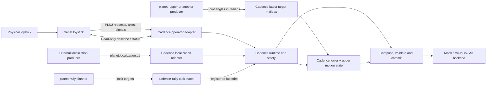
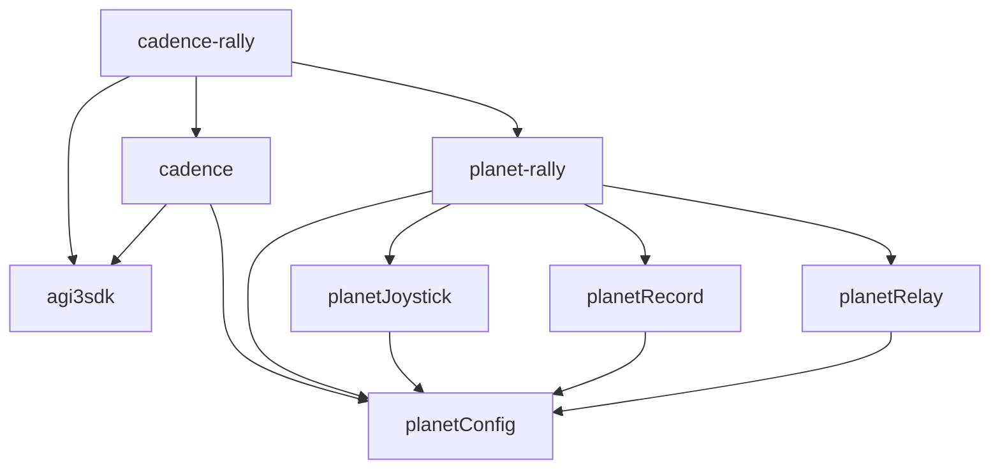

# Architecture and repository boundaries

Cadence owns robot execution and implements receivers for the shared Planet
protocols. planetConfig owns the independent configuration and wire libraries.
PlanetJoystick supplies operator input to compatible receivers without importing
Cadence or the SDK. Task applications extend Cadence with states, transitions and
deployment configuration; they reuse its receiver implementations.

## Repository responsibilities

| Repository | Owns | Reuses |
| --- | --- | --- |
| `agi3sdk` | A3 state synchronization, command submission and native transport | Robot middleware |
| `planetConfig` | Configuration composition, resources, snapshots, operator/target/localization wire contracts and lightweight clients | Python standard library and YAML parser |
| `cadence` | Runtime, safety, state lifecycle, command composition, generic motion, inference, simulation/A3 backends, deployment and protocol receivers | planetConfig and optional A3 SDK |
| `planetJoystick` | Physical device acquisition, configurable bindings, PLNJ publication and continuous upper-joint producers | planetConfig |
| `planetRecord` | Stream schemas, recording, asynchronous clients and replay | planetConfig configuration library |
| `planetRelay` | UDP forwarding, filters, counters and RTT tools | planetConfig configuration library |
| `planet-rally` | Rally perception, prediction, planner and task profiles for operator, recorder, relay and debugging | Planet components and planetConfig |
| `cadence-rally` | Rally execution states, behavior orchestration, task models, task protocol adaptation, task/site deployments and process composition | Cadence and planet-rally |

Generic lower locomotion and fixed/streamed upper-joint control belong to Cadence.
Serve, strike and rally behavior belong to cadence-rally. PlanetJoystick never
imports a task state class or writes robot PD commands.

The robot-localization receiver and A3 backend lifecycle also belong to Cadence.
The PLNU adapter stays in rally because the packet combines localization with
rally-specific planner targets. The shared Planet localization protocol has no
ball, racket or strike semantics and can be implemented by other executors.

## Runtime calls

The planner connection exists only in applications that use that planner.
An independent Cadence deployment can accept PlanetJoystick input without any
rally package. Other input producers can implement the same public protocol.
Relay and recording are optional process services, not steps required to execute
an operator request.

## Source dependencies and Python installation

Arrows here mean pinned source submodules, not Python imports or network calls.
The shared leaf is planetConfig. Planet repositories have no source path back to
Cadence or the SDK. Cadence and the Planet components consume the leaf separately;
runtime network connections do not add source dependencies. Each repository's
`source-workspace.json` lists exactly which packages bootstrap installs.

| Package in the Cadence repository | Contract |
| --- | --- |
| `cadence-config` | Compatibility import layer forwarding to `planet-config` |
| `cadence-protocol` | Compatibility imports and legacy schema defaults forwarding to `planet-protocol` |
| `cadence-api` | Robot state, commands, execution and RobotIO types |
| `cadence` | Execution engine, input adapters, state implementations, inference and backends |

The canonical `planet-config` and `planet-protocol` packages live in planetConfig.
PlanetJoystick uses both; PlanetRecord and PlanetRelay use the configuration
library. The existing `planetj-protocol` package re-exports the shared PLNJ codec.
No Planet component installs a Cadence compatibility package. Cadence retains
those shims for existing executor applications; no second implementation is
maintained. cadence-rally installs one shared source from its pinned Cadence
checkout's `external/planetConfig`; nested copies remain source pins only.

## Binding an operator to a deployment

The receiver's selected catalog is authoritative. A binding has a wire
`request_id` and a `state_key`. Cadence resolves the ID to a catalog key, finds its
registered factory and applies that state's transition rules. A display label
such as `debug_name` does not select a state.

| Profile | State IDs and canonical keys |
| --- | --- |
| Cadence `configs/entry/entry_joystick.yaml` | `0 passive`, `1 damping`, `2 fixedpos`, `3 loco` |
| planet-rally `operators/rally.yaml` | Uses 0–3 and adds `4 hold_static`, `5 hold_move`, `6 serve`, `7 strike` |
| planet-rally `operators/rally_with_fast.yaml` | Inherits rally, adds `8 fast_rally` for a catalog that registers it |

These are provided profiles, not hard-coded IDs in PlanetJoystick. A new task can
choose a different catalog and explicitly configure its bindings. Keep inherited
IDs stable when reusing an existing profile. `planetj --check-remote` checks each
configured name/ID against the running deployment, including catalog aliases.
An unknown runtime request produces a rejection event and does not change state.

Cadence keeps the complete companion producer config in `configs/operators/joystick.yaml`.
The runtime reads its runtime entry; a separately installed PlanetJoystick process
reads `configs/entry/entry_joystick.yaml`. Both the fixed-upper and streamed-upper
A3 operator registries use these bindings. Keeping matching configuration here
adds no PlanetJoystick package dependency or source submodule.

The operator UDP port also answers `planet.operator.v1` JSON `describe` and
`status` queries. `describe` reports registered states and safety destinations.
`status` reports the latest published runtime mode, safety latch and cycle events.
Queries only read snapshots. Sending a request does not guarantee a transition;
state gates and safety still apply. Status is a snapshot, not a durable event log
or a per-request execution receipt.

New clients use `planet.operator.v1`, `planet.joint-target.v1` and
`planet.localization.v1`. Cadence receivers also accept their legacy `cadence.*`
names. Operator and target replies echo the request's recognized schema;
localization is one-way. Legacy `cadence_protocol` clients preserve their old
schema defaults, while `planet_protocol` clients default to the Planet names.

## Configuration inheritance and state lifecycle

Cadence and its task applications keep runtime configuration in their root `configs/` trees. Cadence
requires an explicit `configs/entry/entry_*.yaml`; it contains references to robot,
backend, input and runtime layers. Backend selection, duration, window behavior,
start state and network endpoints are all selected by that configuration chain.
Configuration is not distributed inside the Python package; model assets can be.

The entry's `runtime.state_registry_config` points to an independent catalog mapping
in `configs/state_registries/`. Each `states.<id>.config` refers to a state file in
`configs/states/`, resolved relative to the registry that declared it. A state file's
model paths retain that file's origin. A task can inherit the generic motion contract
through its pinned `external/cadence/configs/states/a3_lower.yaml` or
`a3_lower_stream.yaml` without copying models or deployment defaults.

Device bindings, task bindings and site differences also use explicit configuration
inheritance. `extends` and `compose` merge values; they do not create Python
subclasses or runtime parent states.
Named `inputs.requests` mappings merge one binding at a time; `null` disables an
inherited binding. Legacy lists remain supported and replace the whole list.

The catalog's `factory` selects a state implementation. The runtime separately
controls activation, transition validation, child cancellation and safety. Task
hierarchies compose reusable motion states through these execution contracts.
In command mode, only the command accepted by the backend advances committed
state progress. Readonly deployment runs an explicit shadow evaluation without
calling the backend writer; its state progress is not evidence of robot execution.

Operator heartbeat loss and upper-target loss have different meanings. Expired
PLNJ input supplies no request and zero velocity to the configured slew limiter.
An active streamed-upper state keeps the newest valid joint target indefinitely,
including after sender disconnection. State entry uses the configured default;
exit invalidates the activation. Safety always has priority. See the
[motion contract](motion-composition.md).

## Independent deployment and perception

Both repositories provide their own run script and can be installed and launched as
applications. Cadence runs generic states on mock, MuJoCo or A3. cadence-rally
loads its task states into the shared execution infrastructure; it depends on
the Cadence library, without requiring a separate Cadence process. The same
prepare/guard/write/commit transaction and A3 SDK adapter serve both layers.

Cadence's `scripts/run.sh --config configs/entry/entry_sim.yaml` selects an explicit
entry. The run command exposes only configuration selection, output directory and
`--check`. Both execution and checking save the selected configuration; checking
loads states and models without starting I/O. Sockets and device lifecycles are
created only during execution. See the [deployment guide](deployment.md).

`backend.transport: aimrt` uses actual A3 state and explicitly selected readonly
or command operation. `sdk_mock` is a native SDK conformance fixture with static
state and a memory command sink, not a dynamics simulation. It never enables
hardware publication. Readonly evaluation never calls the SDK writer. Hardware
publication retains the existing A3 confirmation gate and native watchdog.

`runtime.localization` enables the generic external input defined by
`planet-protocol`. Cadence's receiver checks
source identity, coordinate frames, ordered producer sessions/sequences and
freshness, then supplies a backend-neutral `LocalizationState` to the kernel.
It does not transform coordinates or hold expired samples. Each state's root-loss
contract determines whether to hold, reject entry or fall back. Task perception
adapters can supply the same runtime value while keeping their task data local.

The lightweight `LocalizationClient` sends position, orientation and velocity.
Its send result confirms only local UDP submission. Operator status, target
receipts, localization samples and backend command acknowledgments have distinct
meanings; none of the input messages independently certifies robot execution.

## Adding another task

1. Create an application that depends on Cadence. Select its factories in a root
   state registry; reuse Cadence motion factories and models through file references.
2. Extend the generic operator profile with named task bindings. Keep robot
   gains, joint limits and state defaults in the execution deployment; keep
   buttons and producer mappings in the operator profile.
3. Add a planner or target producer only if the task needs one. Use the shared
   configuration loader and public protocol packages for independent processes.
4. Pin direct source dependencies, list explicit bootstrap packages and provide
   the repository's own scripts. Validate bindings against the selected catalog,
   freeze the composed configuration and test the independent deployment.

No new task needs to import cadence-rally or planet-rally. Task debugging profiles
stay with their task; common transport statistics belong to PlanetRelay and
runtime status belongs to Cadence.
