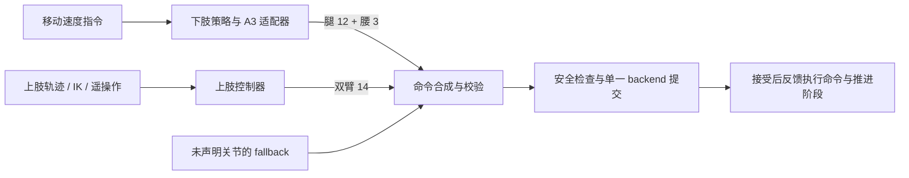

# 下肢移动与自定义上肢动作

`loco_lower` 的下肢策略可以和自定义上肢动作在同一个控制周期中组合：下肢负责移动与支撑，上肢可以执行关节轨迹、IK 目标、遥操作或其他控制器生成的动作。上肢保持默认姿态是当前独立 LOCO 封装的默认行为；组合状态可以提供自己的上肢命令。

## 当前代码归属

| 内容 | 当前归属 |
| --- | --- |
| 调度、安全监督、状态机机制、通用 ONNX 会话与关节命令合成 | `cadence` |
| A3 的 loco / loco_lower 策略适配、观测历史、默认姿态、增益、模型与技能状态 | `cadence-rally` |
| 发球、击球、移动之间的切换，以及上肢动作的业务选择 | `cadence-rally` 的应用编排 |

当前默认 registry 将 `loco` 注册为 `LowerLocoState`，使用 `models/v1_loco_lower.onnx`。这些 A3 基础运动能力目前仍在应用仓库，尚未独立成机器人能力包。跨任务复用不要求将 A3 模型、关节布局或上肢业务动作写入 Cadence 内核。

现有实现有两种使用方式：

- [独立 LowerLocoState](https://github.com/Renforce-Dynamics/cadence-rally/blob/main/src/cadence_rally/states/loco_lower/state.py)：模型输出 15 维腿腰动作，封装生成完整 29 维命令，双臂保持默认姿态。
- [IK 发球组合状态](https://github.com/Renforce-Dynamics/cadence-rally/blob/main/src/cadence_rally/states/ik_serve/state.py)：可以使用 lower policy 控制腿腰，同时使用 14 维手臂轨迹/IK 目标；任务层决定动作阶段和技能切换。其 lower 速度命令设为零，用于支撑发球动作。

第二种方式证明已有腿腰策略与自定义双臂动作的组合入口。任意移动速度与新上肢动作的组合，需要应用提供相应的组合插件和配置；当前独立 `LowerLocoState` 没有直接选择上肢动作的 CLI/YAML 开关。

## A3 的关节控制权

以下是 A3 的规范 29 维顺序；其他机器人由自己的 adapter 定义布局。

| 分区 | 索引 | 默认控制来源 |
| --- | --- | --- |
| 双腿 12 关节 | `0:12` | lower policy |
| 腰部 3 关节 | `12:15` | lower policy |
| 双臂 14 关节 | `15:29` | 自定义上肢控制器，或默认姿态保持 |

这里的“上肢自定义”默认指双臂。腰部仍属于腿腰控制分区；若组合状态需要接管腰部，应显式调整分区和控制来源。每个关节只能由一个来源声明控制权。



## Cadence 合成接口

`CommandPart` 声明控制来源、关节索引和该分区的命令。`compose_commands` 同时合成 `q_des`、`dq_des`、`kp`、`kd`、`tau_ff`，拒绝重叠或越界的关节声明。未被声明的关节保留传入的 fallback。

以下是组合插件中的合成函数，可直接使用现有 API；参数应由应用的机器人配置与控制器生成：

```python
from cadence_api import JointCommand
from cadence.control.composition import CommandPart, compose_commands


def compose_a3_motion(
    lower_command: JointCommand,
    upper_command: JointCommand | None,
    fallback: JointCommand,
) -> JointCommand:
    if len(fallback.q_des) != 29:
        raise ValueError("A3 fallback must contain 29 joints")
    parts = [CommandPart("locomotion", tuple(range(15)), lower_command)]
    if upper_command is not None:
        parts.append(CommandPart("arms", tuple(range(15, 29)), upper_command))
    return compose_commands(parts, fallback)
```

`lower_command` 必须包含 15 维，`upper_command` 必须包含 14 维。它们是经过机器人适配器转换的关节命令，不是未缩放的模型 action。如果复用当前 `LowerLocoState` 产生的完整命令，应对五组字段分别取 `0:15` 作为腿腰分区，再与上肢分区合成。没有上肢控制器时，调用方提供包含上肢保持目标的 fallback。

合成函数不负责运行多个子状态、仲裁任务阶段或自动派发回调。组合插件负责调用各控制器、生成一条完整命令，并向运行时返回；两套控制器不分别向 backend 写命令。

## 执行反馈与模型观测

一次提交遵循 `prepare` → `guard_pending` → backend write → `commit`。backend 接受后，运行时向当前插件调用 `on_command_applied`；组合插件应把实际提交的命令反馈给需要动作历史的控制器。拒绝时调用 `on_command_rejected`，技能阶段与 handoff 不应当作已执行推进。当前 `OnnxPolicyState` 的拒绝回调恢复 `last_action`，不回滚整个观测历史。

下肢模型输出 15 维不代表它只观察 15 个关节。当前 H4 适配器使用全身状态及动作历史。现有 IK 发球状态的 `mask_upper_observation` 会把观测中的双臂位置替换为默认值、速度和历史动作置零；这是该模型组合方式的明确配置，不是 Cadence 对所有 loco 模型的默认处理。新上肢动作应遵守所选模型的观测契约，并检查合成后的限位、增益、平滑和运动效果。

当前 ONNX 状态的执行反馈实现见 [OnnxPolicyState](https://github.com/Renforce-Dynamics/cadence-rally/blob/main/src/cadence_rally/states/policy.py)。接口行为由 [关节合成测试](../tests/test_execution.py) 和 [腿腰与上肢 IK 组合测试](https://github.com/Renforce-Dynamics/cadence-rally/blob/main/tests/control/test_ik_serve_holdmove.py) 覆盖。
